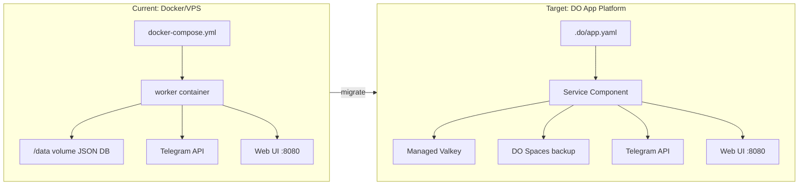

# Heroku Userbot Migration to DigitalOcean App Platform

## Repository and Tooling

- **Git repo**: `https://github.com/bikramkgupta/Heroku` (branch: `master`)
- **Strategy**: Create `app-platform` branch from `master`, all changes go there
- **gh CLI**: Authenticated as `bikramkgupta`
- **doctl**: Authenticated as `bgupta@digitalocean.com`
- **aws CLI**: v2.33.12 (for Spaces bucket ops)
- **jq**: v1.8.1, **s3cmd**: v2.4.0

### What the agent handles (no user input needed)

- Create the `app-platform` branch
- Refactor Dockerfile, create entrypoint.sh, .do/app.yaml, .env.example
- Write migration-steps.md
- Push branch to GitHub
- Create Spaces key via `doctl spaces keys create`
- Create Spaces bucket via `aws s3api create-bucket`
- Deploy to App Platform

### What the user provides (only at deploy time, step t10)

- Telegram API credentials (`api_id`, `api_hash`) -- only needed when the app actually runs

---

## Application Analysis

**What it is**: A Telegram userbot framework (fork of Hikka/FTG) named "Heroku Userbot" that automates Telegram user accounts. Despite the name, it has **zero Heroku platform dependencies** -- no Procfile, no app.json, no heroku.yml. It is purely Docker-based.

**Core components**:

- Python 3.10 application (entry: `python -m heroku`)
- aiohttp web server on port 8080 (setup UI, QR login, API config)
- Plugin/module system with dynamic loading
- JSON file database (`config-{user_id}.json`) with optional Redis backend
- Telegram API integration via `herokutl` library
- Inline bot features, command dispatcher, security system

**Heavy system dependencies** (all in Dockerfile):

- FFmpeg + media libs, Node.js 18, wkhtmltopdf, Cairo graphics, Git, SSH server

**Current deployment model**:

- Dockerfile clones `coddrago/Heroku` from GitHub at build time
- docker-compose with a `worker` service, persistent `/data` volume, port 8080
- GitHub Actions pushes to Docker Hub as `codrago/heroku:latest`

---

## Key Migration Challenges

1. **Dockerfile clones from GitHub** -- Must refactor to `COPY` local source instead
2. **Persistent volume (`/data`)** -- App Platform has no persistent disk; use Valkey as primary DB, Spaces for backup
3. **Large image** -- Heavy system deps (FFmpeg, Node.js, wkhtmltopdf) will produce a ~1GB+ image; need to optimize
4. **Runs as root** -- Dockerfile uses `--root` flag; App Platform allows this but worth noting
5. **Platform detection flags** -- Code checks `IS_DOCKER`, `IS_LAVHOST`, etc.; may want a `IS_DO_APP_PLATFORM` flag

---

## Migration Architecture



---

## Deliverables

### 1. `migration-steps.md` -- Step-by-step migration guide

Comprehensive markdown document covering:

- Phase 0: Local verification (run current Docker setup, confirm it works)
- Phase 1: Dockerfile refactoring (COPY local source, optimize layers)
- Phase 2: Add Valkey support (configure `REDIS_URL` env var, the app already supports it)
- Phase 3: Add Spaces backup (s3cmd-based periodic backup of `/data` directory)
- Phase 4: Create `.do/app.yaml` App Platform spec
- Phase 5: Push to GitHub, deploy to App Platform
- Phase 6: Post-migration verification

### 2. Refactored `Dockerfile`

Key changes:

- Replace `git clone` with `COPY . /Heroku`
- Remove the self-update logic (App Platform handles deploys)
- Install `s3cmd` for Spaces backup
- Add an entrypoint wrapper script for backup/restore on start/stop

### 3. `.do/app.yaml` -- App Platform spec

```yaml
name: heroku-userbot
region: nyc
services:
  - name: userbot
    dockerfile_path: Dockerfile
    github:
      repo: bikramkgupta/Heroku
      branch: app-platform
      deploy_on_push: true
    http_port: 8080
    instance_size_slug: apps-s-1vcpu-2gb
    instance_count: 1
    envs:
      - key: REDIS_URL
        scope: RUN_TIME
        type: SECRET
        value: "${valkey.REDIS_URL}"  # auto-bound from managed Valkey
      - key: DOCKER
        value: "true"
      - key: SPACES_ENDPOINT
        value: "https://nyc3.digitaloceanspaces.com"
      - key: SPACES_BUCKET
        value: "heroku-userbot-backup"
      - key: SPACES_ACCESS_KEY
        scope: RUN_TIME
        type: SECRET
      - key: SPACES_SECRET_KEY
        scope: RUN_TIME
        type: SECRET
databases:
  - name: valkey
    engine: REDIS
    production: false  # dev database; set true for production
```

Note: Spaces keys are created via `doctl spaces keys create` (step t09) and injected at deploy time. No manual key creation needed.

### 4. Entrypoint wrapper script (`entrypoint.sh`)

- On startup: restore `/data` from Spaces via s3cmd (if backup exists)
- Run `python -m heroku --root`
- On SIGTERM: backup `/data` to Spaces before exit
- Periodic backup every N minutes via background process

### 5. `.env.example` -- Template for required environment variables

```
# Telegram API (get from https://my.telegram.org/apps)
api_id=
api_hash=

# Valkey/Redis (auto-bound from App Platform managed DB)
REDIS_URL=

# DigitalOcean Spaces (for backup)
SPACES_ENDPOINT=https://nyc3.digitaloceanspaces.com
SPACES_ACCESS_KEY=
SPACES_SECRET_KEY=
SPACES_BUCKET=heroku-userbot-backup
```

---

## What We Will NOT Change

- The application code itself (no refactoring of `heroku/` Python package)
- The module system or plugin architecture
- The web UI or Telegram integration logic
- The security system

The migration is infrastructure-only: change where and how it runs, not what it does.
